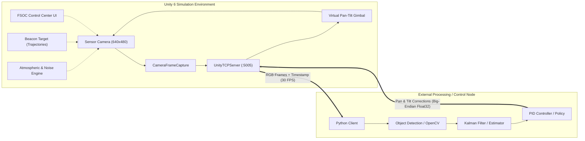

# 🛰️ FSOC Simulation: Real-Time Optical Beam Acquisition & Tracking System

<p align="center">
  
</p>

[](https://unity.com/)
[](https://docs.microsoft.com/en-us/dotnet/csharp/)
[](#-telemetry--control-tcp-protocol)
[](https://github.com/)
[](https://github.com/)

A high-fidelity **Free-Space Optical Communication (FSOC)** simulation environment built in **Unity 6**. Designed to emulate satellite/ground optical transceivers, dynamic beacon acquisition, atmospheric and channel disturbances, platform vibrations, and real-time closed-loop pointing, acquisition, and tracking (PAT) algorithms over a high-speed TCP socket bridge.

---

## 📌 Table of Contents

- [Overview](#-overview)
- [System Architecture](#-system-architecture)
- [Key Features](#-key-features)
- [Project Directory Structure](#-project-directory-structure)
- [Telemetry & Control TCP Protocol](#-telemetry--control-tcp-protocol)
- [External Python Client Example](#-external-python-client-example)
- [Getting Started](#-getting-started)
- [Simulation Controls & Keybindings](#-simulation-controls--keybindings)
- [Tech Stack](#-tech-stack)

---

## 🔭 Overview

In Free-Space Optical Communication (FSOC), establishing and maintaining a narrow optical laser link between moving terminals (e.g., Satellite-to-Ground, Satellite-to-Satellite, UAV-to-Ground) requires sub-milliradian precision Pointing, Acquisition, and Tracking (PAT).

This simulation platform provides:
1. **Realistic Physical & Visual Emulation**: Optical sensor capture, gimballing pan-tilt mechanics, realistic 3D trajectories, stellar backgrounds, and atmospheric transmission loss.
2. **Channel & Platform Degradations**: Real-time camera jitter, platform motion drift, custom GPU noise shaders, and weather conditions (Fog, Haze, Rain, Low-Light).
3. **Hardware-in-the-Loop (HIL) & AI Bridge**: Direct TCP streaming of raw RGB frames (640x480 @ 30 FPS) with microsecond timestamps and bi-directional control input reception for external Python, OpenCV, Kalman filter, or deep learning tracking agents.
4. **Mission Control Center HUD**: Live in-engine engineering dashboard providing real-time telemetry, tracking errors, gimbal angles, target metrics, and lock states.

---

## 🏗️ System Architecture



---

## ✨ Key Features

### 1. 🎯 Virtual Pan-Tilt Optical Terminal
- Continuous 2-DOF gimbal control with configurable angular limits:
  - **Pan**: `-90.0°` to `+90.0°`
  - **Tilt**: `-45.0°` to `+45.0°`
- Dynamic slew rate limits and smooth mechanical actuation response.
- Dual input mode: Manual keyboard operator override or automated TCP delta corrections.

### 2. 🛰️ Dynamic Target Trajectories
- **Straight Line**: Linear transit across sensor field of view.
- **Circular Orbit**: Fixed-radius orbital sweep for rotational tracking tests.
- **Figure-8 (Lissajous)**: Multi-axial acceleration testing.
- **Random Wander**: Stochastic 3D pathing to test predictive filter robustness under non-deterministic maneuvers.

### 3. 🌫️ Environmental & Physical Disturbances
- **Atmospheric Modeling**: Dynamic switching between Clear, Haze, Fog, Rain, and Low-Light with intensity sliders.
- **Sensor Noise Shaders**: Custom GPU post-processing simulating photodiode thermal noise, dark current, and optical scattering.
- **Micro-Vibrations & Jitter**: High-frequency jitter mimicking satellite reaction wheels and aerodynamic buffeting.
- **Platform Motion**: Low-frequency oscillatory base sway (shipboard / aircraft / orbit sway).
- **Deep Space Visuals**: Procedural star field generation with realistic optical point spread functions (PSF).

### 4. ⚡ Low-Latency Bi-Directional TCP Bridge
- Asynchronous multi-threaded streaming server operating over port `5005`.
- Header timestamping using high-precision OS hardware performance counters (`Stopwatch.GetTimestamp`).
- Zero memory leakage texture buffer pipeline for rock-solid 30+ FPS streaming.

### 5. 🖥️ FSOC Control Center Dashboard
- Dedicated dark engineering dashboard.
- Live tracking status (LOCKED / ACQUIRING / LOST).
- Real-time ground-truth metrics: Target distance, relative velocity, 2D focal-plane pixel error, gimbal angles, and telemetry frame rate.

<p align="center">
  
</p>

---

## 📁 Project Directory Structure

```
My project/
├── Assets/
│   ├── Config/
│   │   └── Trajectories/               # Preset flight profile configurations
│   ├── Materials/                      # Terminal, laser, and environmental materials
│   ├── Scenes/
│   │   └── FSOC_Simulation_Main.unity  # Primary simulation scene
│   ├── Scripts/
│   │   ├── CameraFrameCapture.cs       # Render texture buffer extraction
│   │   ├── FSOCControlCenterUI.cs      # Mission Control telemetry UI overlay
│   │   ├── CameraSystem/
│   │   │   ├── CameraConfiguration.cs  # Optical FOV, focal length & sensor specs
│   │   │   └── VirtualPanTiltCamera.cs # Gimbal kinematics and motor controls
│   │   ├── Environment/
│   │   │   ├── AtmosphericConditions.cs# Weather & optical attenuation
│   │   │   ├── CameraJitter.cs         # Micro-vibration generator
│   │   │   ├── ImageNoise.cs           # GPU noise & sensor degradation controller
│   │   │   ├── PlatformMotion.cs       # Base dynamics & structural sway
│   │   │   └── SpaceEnvironment.cs     # Starfield & background generator
│   │   ├── Networking/
│   │   │   └── UnityTCPServer.cs       # Multi-threaded TCP stream & command handler
│   │   ├── Targets/
│   │   │   ├── BeaconTarget.cs         # Beacon optical source definition
│   │   │   └── Trajectories/           # Trajectory solvers (Circle, Line, Fig8, Random)
│   │   └── Tracking/
│   │       ├── GroundTruthProjection.cs# 3D to 2D screen coordinate error solver
│   │       └── TempGroundTruthTracker.cs# Diagnostic ground truth tracker
│   ├── Settings/                       # URP / Render pipeline configurations
│   └── Shaders/
│       └── ImageNoiseShader.shader     # Sensor thermal & background noise shader
└── ProjectSettings/                    # Unity project & engine settings
```

---

## 📡 Telemetry & Control TCP Protocol

The `UnityTCPServer` communicates over a standard TCP socket on port `5005`.

### 📤 Server to Client: Video Frame Packet

Each frame streamed from Unity has a **12-byte header** followed by raw uncompressed RGB pixel bytes:

| Offset | Data Type | Field | Description |
| :--- | :--- | :--- | :--- |
| `0..3` | `uint32` (Big-Endian) | `frameId` | Monotonically increasing frame counter |
| `4..11` | `float64` (Big-Endian) | `timestamp` | High-precision server timestamp (seconds) |
| `12..N` | `byte[]` | `raw_rgb` | `640 x 480 x 3` bytes = **921,600 bytes** RGB24 payload |

*Total Packet Size:* `12 + 921600 = 921,612 bytes`

### 📥 Client to Server: Pan/Tilt Delta Command

The external tracking agent sends **8 bytes** containing pan and tilt angular correction increments:

| Offset | Data Type | Field | Description |
| :--- | :--- | :--- | :--- |
| `0..3` | `float32` (Big-Endian) | `panDelta` | Pan angle adjustment in degrees |
| `4..7` | `float32` (Big-Endian) | `tiltDelta` | Tilt angle adjustment in degrees |

---

## 🐍 External Python Client Example

Here is a ready-to-run Python client demonstrating how to connect, receive live frames, display with OpenCV, and send tracking correction commands:

```python
import socket
import struct
import numpy as np
import cv2

HOST = '127.0.0.1'
PORT = 5005
FRAME_WIDTH = 640
FRAME_HEIGHT = 480
IMAGE_SIZE = FRAME_WIDTH * FRAME_HEIGHT * 3
HEADER_SIZE = 12
PACKET_SIZE = HEADER_SIZE + IMAGE_SIZE

def receive_exact(sock, num_bytes):
    data = bytearray()
    while len(data) < num_bytes:
        packet = sock.recv(num_bytes - len(data))
        if not packet:
            return None
        data.extend(packet)
    return bytes(data)

def main():
    print(f"[Connecting] Connecting to Unity FSOC Server at {HOST}:{PORT}...")
    client = socket.socket(socket.AF_INET, socket.SOCK_STREAM)
    client.connect((HOST, PORT))
    print("[Connected] Stream established. Press 'q' in OpenCV window to exit.")

    try:
        while True:
            # 1. Receive video frame packet
            packet = receive_exact(client, PACKET_SIZE)
            if packet is None:
                print("[Disconnected] Connection closed by Unity.")
                break

            # 2. Parse 12-byte header
            frame_id = struct.unpack('>I', packet[0:4])[0]
            timestamp = struct.unpack('>d', packet[4:12])[0]
            raw_rgb = packet[12:]

            # 3. Convert to OpenCV NumPy image
            frame = np.frombuffer(raw_rgb, dtype=np.uint8).reshape((FRAME_HEIGHT, FRAME_WIDTH, 3))
            frame_bgr = cv2.cvtColor(frame, cv2.COLOR_RGB2BGR)

            # --- INSERT YOUR TRACKING / KALMAN / PID LOGIC HERE ---
            # Example placeholder: computing correction deltas
            pan_delta = 0.0   # in degrees
            tilt_delta = 0.0  # in degrees
            # -----------------------------------------------------

            # 4. Send correction back to Unity (8 bytes, Big-Endian float32)
            command_packet = struct.pack('>ff', float(pan_delta), float(tilt_delta))
            client.sendall(command_packet)

            # 5. Display live camera feed
            cv2.putText(frame_bgr, f"Frame: {frame_id} | Time: {timestamp:.2f}s", (10, 25),
                        cv2.FONT_HERSHEY_SIMPLEX, 0.6, (0, 255, 0), 2)
            cv2.imshow("FSOC Sensor Camera Feed", frame_bgr)

            if cv2.waitKey(1) & 0xFF == ord('q'):
                break

    finally:
        client.close()
        cv2.destroyAllWindows()

if __name__ == "__main__":
    main()
```

---

## 🚀 Getting Started

### Prerequisites
- **Unity 6** (`6000.5.10f1` or compatible)
- **Universal Render Pipeline (URP)**
- **Unity Input System** package

### Installation & Run
1. Clone the repository:
   ```bash
   git clone https://github.com/NoorulHamdh1/SIH2026.git
   cd SIH2026
   ```
2. Open **Unity Hub** -> Click **Add project from disk** -> Select this repository folder.
3. Open the project using **Unity 6000.5.10f1**.
4. In the Project window, open `Assets/Scenes/FSOC_Simulation_Main.unity`.
5. Hit **Play** (▶️) in the Unity Editor.
6. Run your external Python algorithm or controller script to start closed-loop tracking!

---

## 🎮 Simulation Controls & Keybindings

| Key / Control | Action |
| :--- | :--- |
| <kbd>A</kbd> / <kbd>D</kbd> or <kbd>←</kbd> / <kbd>→</kbd> | Manual Pan Left / Right |
| <kbd>W</kbd> / <kbd>S</kbd> or <kbd>↑</kbd> / <kbd>↓</kbd> | Manual Tilt Up / Down |
| **Inspector Controls** | Adjust Atmospheric conditions, noise intensity, and target trajectory |

---

## 🧰 Tech Stack

- **Engine & Core**: [Unity 6](https://unity.com/), C#, HLSL ShaderLab
- **Networking**: High-throughput asynchronous TCP Sockets (TCP/IP)
- **Mathematical Modeling**: 3D Coordinate Transforms, Kinematics, Stochastic Noise & Micro-vibration generation
- **Companion Stack**: Python 3, OpenCV, NumPy, SciPy, FilterPy (Kalman Filtering), PyTorch

---

## 📄 License

This project is developed for **Smart India Hackathon (SIH 2026)**. Distributed under the MIT License. See `LICENSE` for more information.
